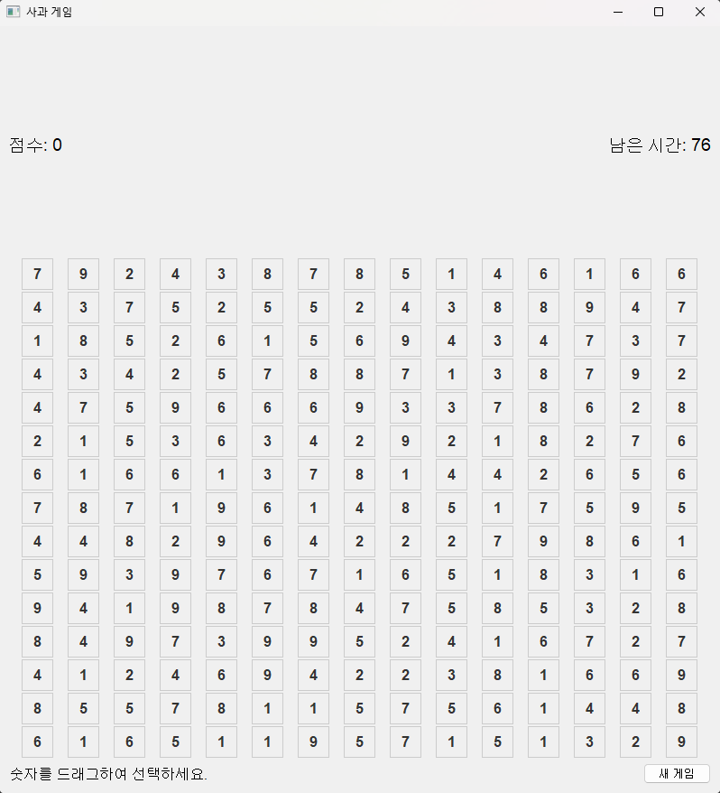

<h1>🍎 사과 게임 🍏</h1>

---
## ❓ 이 게임은요
- 퍼즐 게임입니다.
- [사과 게임](https://www.gamesaien.com/game/fruit_box_a/)의 모작입니다.

---
## 🎮 게임 플레이 방법
1. 1~9까지의 숫자가 15X15 게임판에 랜덤하게 배치됩니다. 
2. 숫자를 마우스로 드래그하여 숫자의 합이 정확히 10이 되도록 하세요. 
3. 숫자는 최소 두 개부터 드래그할 수 있습니다. 
4. 최대한 많은 숫자를 제거하여 점수를 얻으세요. 
5. 제한 시간은 90초입니다. 
6. 합이 10이 된다면 공백을 사이에 두거나 대각선에 위치한 숫자도 제거할 수 있습니다. 

---
## ⭐ 개발 툴
1. Pyqt5

2. Gemini CLI

---
## 📆 개발 기간
- 2025.07.03 ~ 

